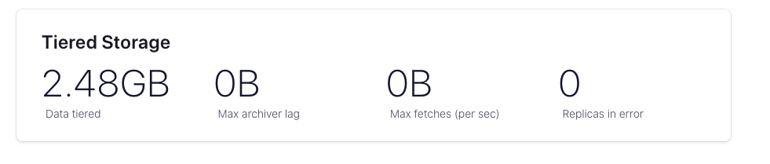

# readme

short example how to use confluent tiered storage with minio

### install minio (linux binary mode)


```
wget https://dl.min.io/server/minio/release/linux-amd64/minio
sudo mv minio /usr/bin
sudo chmod +x /usr/bin/minio
minio --v
export MINIO_ROOT_USER=admin 
export MINIO_ROOT_PASSWORD=welcome1 
nohup minio server /data/minio --console-address ":9001" > minio.out & 
```

```
wget https://dl.min.io/client/mc/release/linux-amd64/mc
sudo mv mc /usr/bin
sudo chmod +x /usr/bin/mc
mc alias set local http://192.168.36.240:9000 admin welcome1
```

### test minio console
$your_ip:9001
credentials above

### create a bucket

```
mc mb local/kafka

mc admin user add local kafka-user kafka-top-secret-key
```

add policy 
```
mc admin policy add local my-kafka-policy /tmp/policy-kafka.tx 
mc admin policy set local my-kafka-policy user=kafka-user
```

### enable encryption for minio
Server-Side Encryption Per-Deployment Key (SSE-S3)

install kes
```
wget https://github.com/minio/kes/releases/download/v0.19.3/kes-linux-amd6
sudo move kes /usr/local/bin/
sudo mv kes /usr/local/bin/
sudo chmod +x /usr/local/bin/kes
```

generate TLS private key and cert (note down the output)
```
kes identity new --ip "127.0.0.1" localhost
```

generates a new TLS private/public key pair for auth (note down as well)
```
kes identity new --key=client.key --cert=client.crt kafka
```

create a config.yml with the following content
```
address: 0.0.0.0:7373 # Listen on all network interfaces on port 7373

admin:
  identity: disabled  # We disable the admin identity since we don't need it in this guide 
   
tls:
  key: private.key    # The KES server TLS private key
  cert: public.crt    # The KES server TLS certificate
   
policy:
  kafka: 
    allow:
    - /v1/key/create/my-key*
    - /v1/key/generate/my-key*
    - /v1/key/decrypt/my-key*
    identities:
    - 02ef5321ca409dbc7b10e7e8ee44d1c3b91e4bf6e2198befdebee6312745267b # Use the identity of your client.crt
   
keystore:
  fs:
    path: ./keys # Choose a directory for the secret keys
```

start the kes server
```
nohup kes server --config config.yml --auth off > kes.log &
```

now enable minio encryption
download a demo cert and key
```curl -sSL --tlsv1.2 \
  -O 'https://raw.githubusercontent.com/minio/kes/master/root.key' \
  -O 'https://raw.githubusercontent.com/minio/kes/master/root.cert'
```

set env vars
```
export KES_CLIENT_KEY=root.key
export KES_CLIENT_CERT=root.cert
```

create a key with kes
```
kes key create my-minio-key
```

set the env vars for minio
```
export MINIO_KMS_KES_ENDPOINT=https://localhost:7373
export MINIO_KMS_KES_KEY_FILE=root.key
export MINIO_KMS_KES_CERT_FILE=root.cert
export MINIO_KMS_KES_KEY_NAME=my-minio-key
```

restart minio
```
mc admin service restart local
```

enable bucket encryption
```
mc encrypt set sse-s3 local/kafka
```

### the kafka part
create a sample kafka cluster with 1 broker (don't use for production)
use the docker-compose.yml or adapt your docker-compose accordingly.

docker-compose up -d 


create a topic

```
docker exec -it kafka-1 kafka-topics --bootstrap-server kafka-1:9092   \
  --create --topic hot-topic \
  --partitions 6 \
  --replication-factor 1 \
  --config confluent.tier.enable=true \
  --config confluent.tier.local.hotset.ms=60000 \
  --config retention.ms=604800000 \
  --config segment.bytes=10485760
```


create some test data (for 5-10 minutes)
```
docker exec -it kafka-1  kafka-producer-perf-test \
   --producer-props bootstrap.servers=kafka-1:9092 \
   --topic hot-topic \
   --record-size 1000 \
   --throughput 1000 \
   --num-records 3600000
```

consume data (for about 10 minutes)
```
docker exec -it kafka-1  kafka-console-consumer --bootstrap-server kafka-1:9092 --from-beginning --topic hot-topic &
```

wait some time after finishing consumer.
some data should be created in the minio bucket and Confluent control center should
show some tiered storage usage.




kes identity new --ip "127.0.0.1" localhost

  Private key:  private.key
  Certificate:  public.crt
  Identity:     1bbb318caeaac7057f84f9a62d52687b6f471a90386f1be5719b9bc703d93ed0


    Private key:  client.key
  Certificate:  client.crt
  Identity:     737587542e80898f186e0870ce923230694f9d7e320253fd8144d7d7c7ad46b1